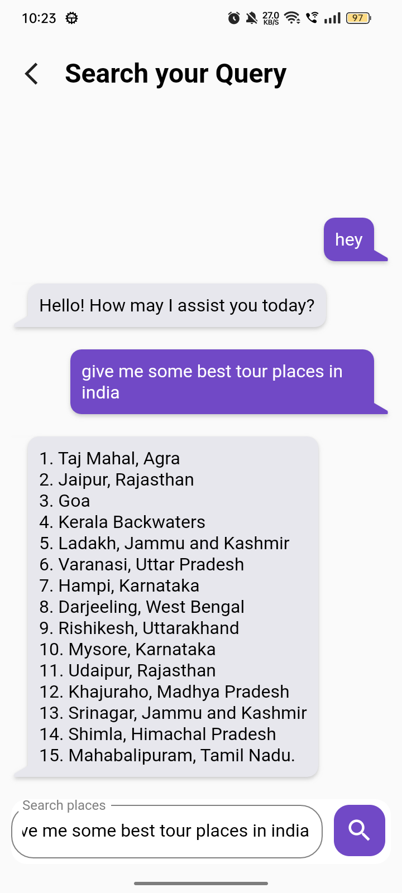

# travee
travee is a travel & tourism based flutter app, travee gives you travel packages based on  categories, like trekking, weekends, beach, road trips and many more.

travee app is developed to work with android and ios phones, With a responsive UI 

ChatGPT is integrated in travee app as an support assistant.

# Screenshots

<table>
  <tr>
    <td><b>Home screen</b></td>
     <td><b>Categories screen</b></td>
  </tr>
  <tr border="1">
    <td></td>
    <td></td>
  </tr>
 </table>
 
 
 <table>
  <tr>
    <td>Tour package screen</td>
     <td>ChatGPT screen</td>
  </tr>
  <tr>
    <td></td>
    <td></td>
  </tr>
 </table>

# Videos

https://github.com/dodiyaindrajit/travee-flutter-app/assets/8991251/389240a8-076f-4b88-a3f5-00a3b023585d
https://github.com/dodiyaindrajit/travee-flutter-app/assets/8991251/1e058383-f93f-4ed4-b829-94501e5e1a31
https://github.com/dodiyaindrajit/travee-flutter-app/assets/8991251/32df014e-bbbb-4576-b487-cda9d0147bf8

